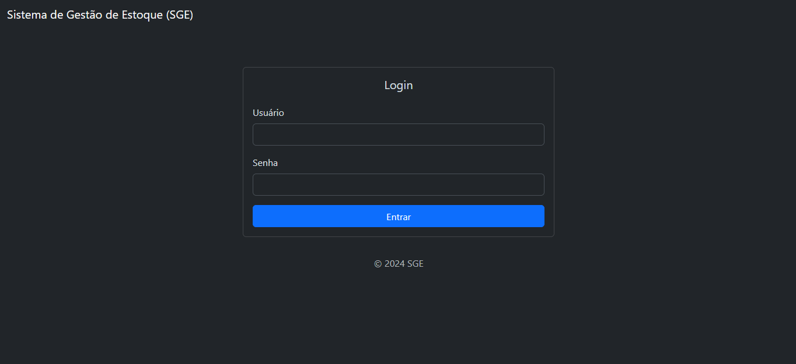
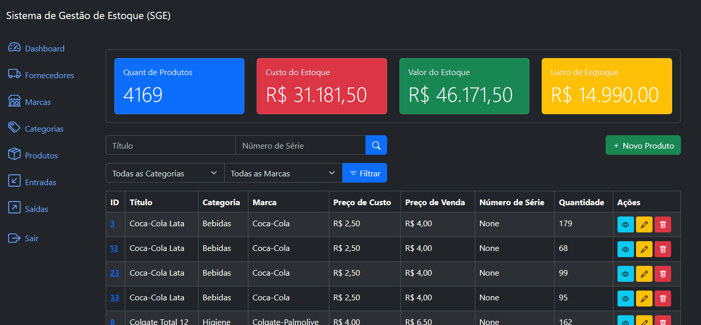

# SGE - Enterprise Management System


This project is an enterprise management system (SGE) developed in Django, featuring JWT authentication, permission control, registration and management of products, brands, categories, suppliers, stock inflows and outflows, as well as reports and metrics.

## Features

-   Registration and management of **Products**, **Brands**, **Categories**, and **Suppliers**
-   Control of **Stock Inflows** and **Outflows**
-   Sales and movement reports and metrics
-   Detailed permissions by user and group
-   RESTful API with JWT authentication (via [Django REST Framework](https://www.django-rest-framework.org/))
-   Administrative interface via Django Admin
-   Filters, pagination, and search

## Technologies Used

-   Python 3.12+
-   Django 5.2
-   Django REST Framework
-   SimpleJWT
-   Bootstrap 5 (frontend)
-   SQLite (default, can be changed to other databases)

## Screenshots

See below some screenshots of the SGE system in action:

**Login screen**

<p align="center">
  
</p>

**Dashboard**

<p align="center">
  
</p>

**Product List**

<p align="center">
  
</p>

## Installation

1. **Clone the repository:**

    ```bash
    git clone https://github.com/your-user/sge.git
    cd sge
    ```

2. **Create and activate a virtual environment:**

    ```bash
    python -m venv venv
    venv\Scripts\activate  # Windows
    # or
    source venv/bin/activate  # Linux/Mac
    ```

3. **Install the dependencies:**

    ```bash
    pip install -r requirements.txt
    ```

4. **Apply the migrations:**

    ```bash
    python manage.py migrate
    ```

5. **Create a superuser:**

    ```bash
    python manage.py createsuperuser
    ```

6. **(Optional) Populate the database with mock data:**  
   See the section below about `seed_data.py`.

7. **Run the server:**
    ```bash
    python manage.py runserver
    ```

## Populating the Database with Mock Data

This project includes a script called `seed_data.py` to populate the database with mock categories, brands, suppliers, products, inflows, and outflows, making testing and demonstrations easier.

### How to use `seed_data.py`

1. **Apply the migrations before running the script:**

    ```bash
    python manage.py migrate
    ```

2. **Open the Django shell:**

    ```bash
    python manage.py shell
    ```

3. **Run the seed script:**

    ```python
    from seed_data import run
    run()
    ```

4. **Done!**
    - The database will be populated with sample data for all main entities of the system.

> **Tip:**  
> The script can be run as many times as you want, but it may generate duplicate records if run multiple times without cleaning the database.

## Usage

-   Access the system at [http://localhost:8000/](http://localhost:8000/)
-   Access the admin at [http://localhost:8000/admin/](http://localhost:8000/admin/)
-   Access the API at [http://localhost:8000/api/v1/](http://localhost:8000/api/v1/)

## API Authentication

-   Use the `/api/token/` endpoint to obtain a JWT token.
-   Send the token in the header `Authorization: Bearer <your_token>` in protected requests.

## Permissions

-   The system uses Django's default permissions (`add`, `change`, `delete`, `view`) and can be customized.
-   In Django Admin, assign permissions to users or groups as needed.

## App Structure

-   `brands`: Product brands
-   `categories`: Product categories
-   `products`: Products
-   `suppliers`: Suppliers
-   `inflows`: Stock inflows
-   `outflows`: Stock outflows
-   `authentication`: Authentication and users

## License

This project is distributed under the MIT license.
